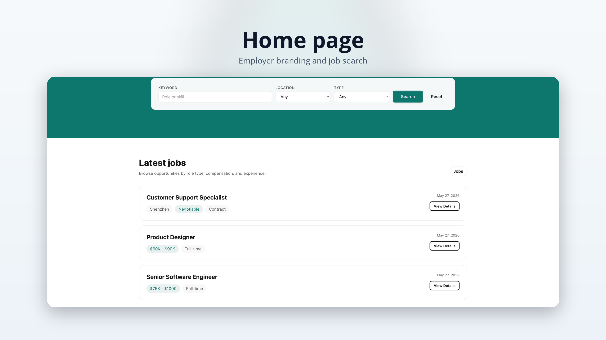
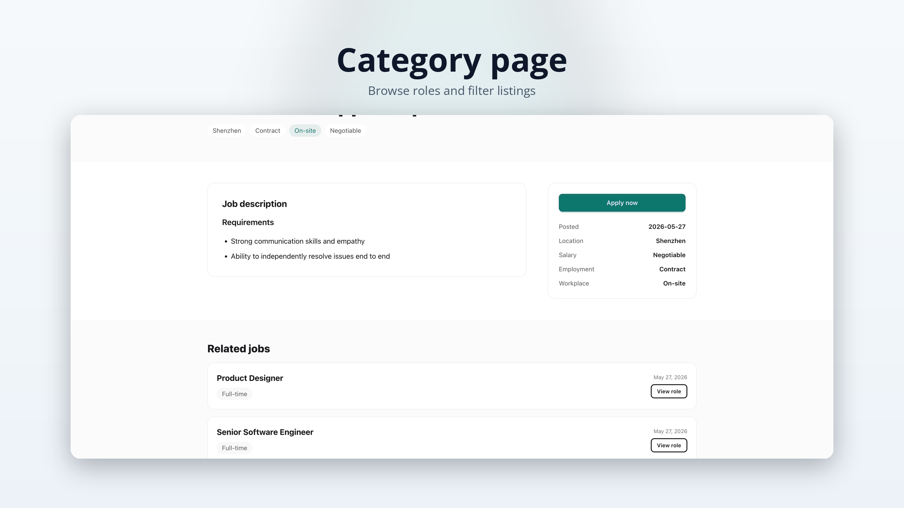
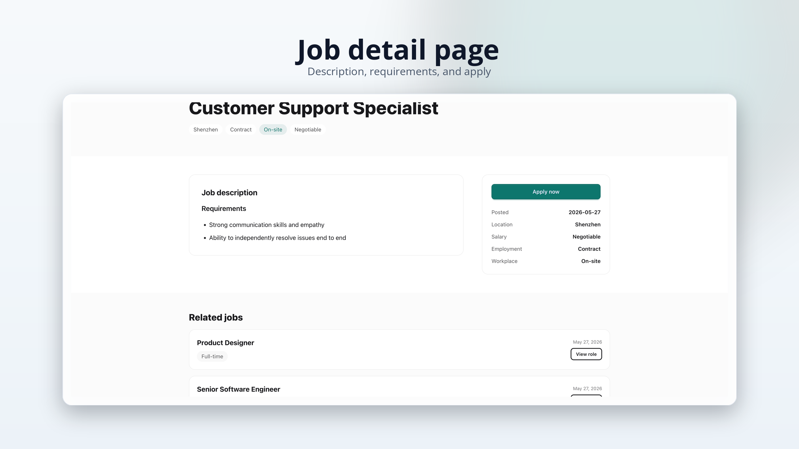
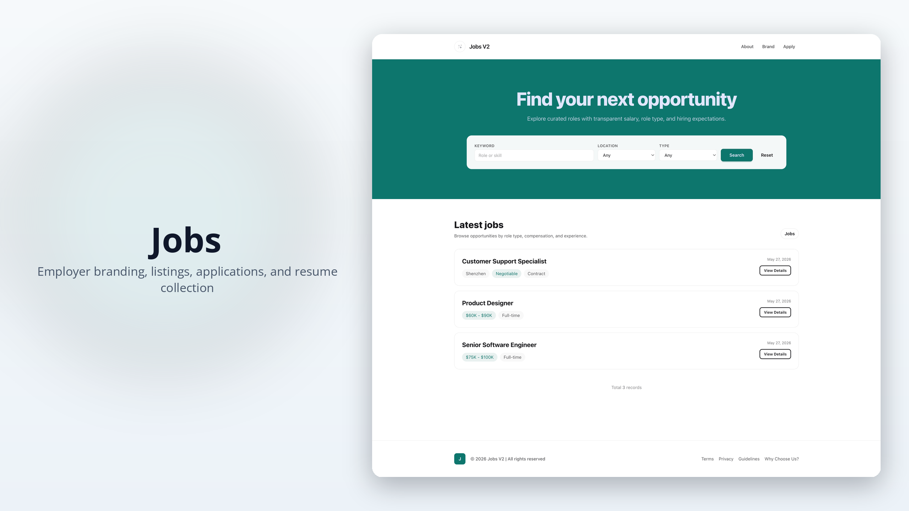
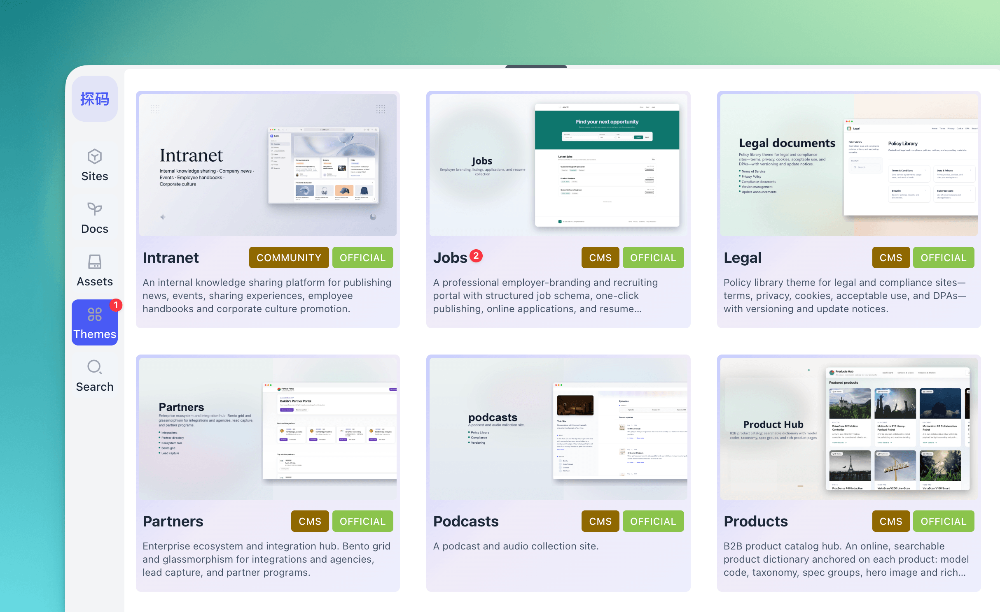
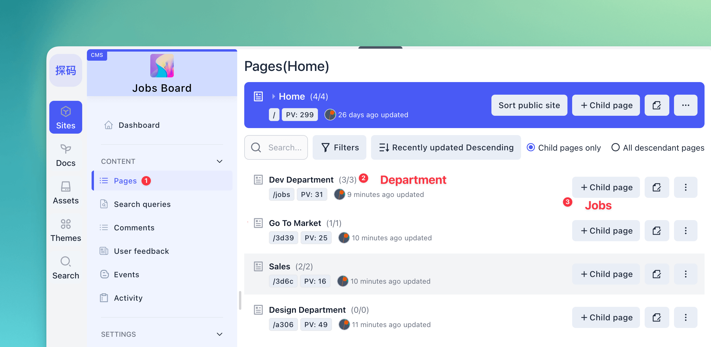
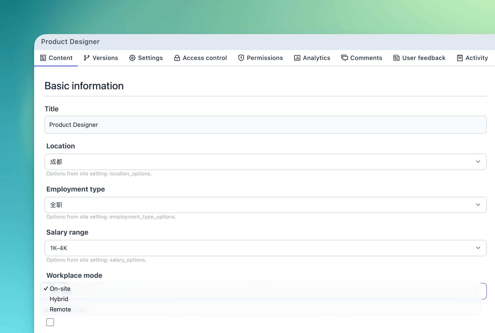
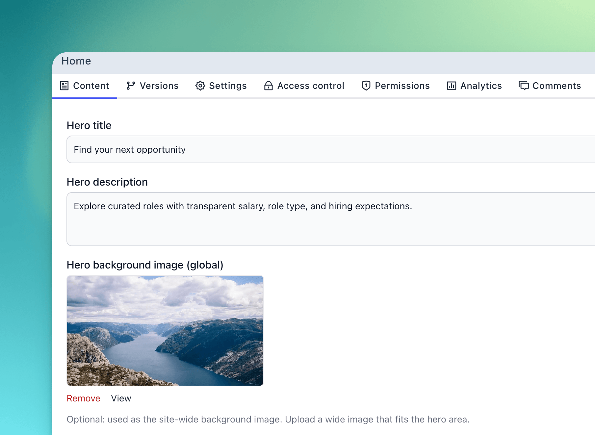

# Baklib CMS — 招聘门户主题（简体中文说明）

面向 Baklib 站点的轻量 **招聘门户 / 雇主品牌 / 职位发布** 主题：提供清晰的职位列表与分类、结构化的职位字段（地点、用工类型、薪资、办公方式等）、在线申请与简历收集模块，样式基于 Tailwind CSS 与 daisyUI。

模板 git 地址：https://github.com/baklib-templates/jobs

---

## 功能概览

目录结构

| 路径                          | 说明                                                  |
| ----------------------------- | ----------------------------------------------------- |
| `templates/`                  | 页面模板                                              |
| `snippets/`                   | 可复用片段                                            |
| `layout/`                     | 全站布局 `theme.liquid`                               |
| `config/settings_schema.json` | 主题设置定义                                          |
| `locales/`                    | 前台文案（`*.json`）与 schema 翻译（`*.schema.json`） |
| `seeds/`                      | 示例站点与页面（**默认英文**）                        |
| `assets/`                     | 构建后的 CSS/JS                                       |
| `src/`                        | 样式与 JS 源码                                        |

---

- **首页**（`templates/index.liquid`）：招聘首页，支持职位搜索、部门/频道分类导航、职位列表以及精选职位推荐。
- **招聘频道/栏目页**（`templates/channel.liquid`）：展示该部门或特定分类下的全部职位，支持按工作地点、用工类型、薪资等条件做多重过滤。
- **职位详情页**（`templates/page.liquid`）：展示职位的基本信息（地点、用工类型、薪资、办公方式）、技能标签、岗位职责、任职要求等，提供一键申请与联系表单。
- **搜索**（`templates/search.liquid`）、**标签列表**（`templates/tag.liquid`）。

---

## 效果预览

|              首页 (职位列表)               |                   分类频道页                    |
| :----------------------------------------: | :---------------------------------------------: |
|   |  |
|               **职位详情页**               |                **封面 (缩略图)**                |
|  |        |

---

## 安装教程

在 Baklib 模板市场中找到【Jobs】，点击安装，即可完成。

|                   1. 选择并安装主题                    |                       2. 添加频道与职位                        |
| :----------------------------------------------------: | :------------------------------------------------------------: |
|  |  |
|                  **3. 职位发布设置**                   |                      **4. 首页视觉配置**                       |
|  |        |

---

## 其它文档

- 英文总览：[README.md](./README.md)
- 主题帮助：[www.baklib.com/themes](https://www.baklib.com/themes/jobs)
